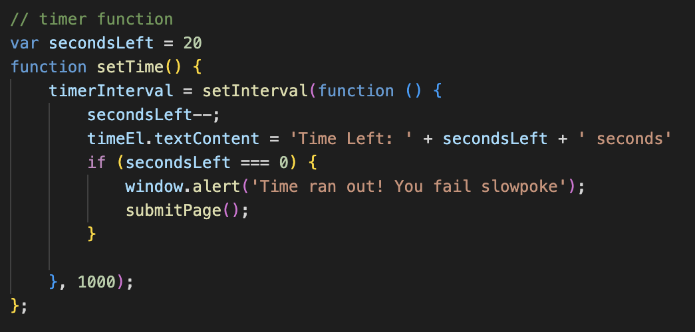
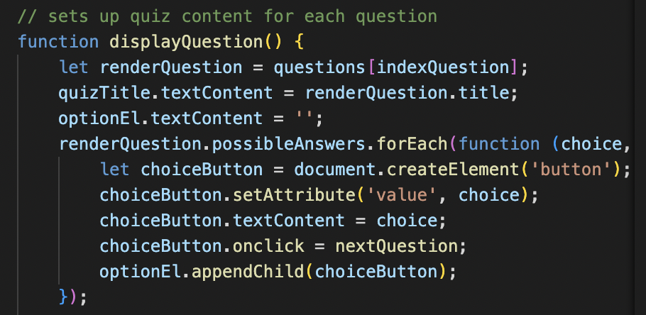
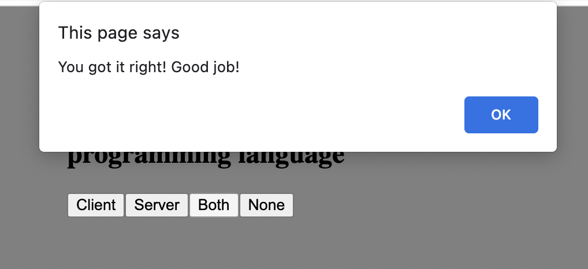

# Code Quiz

## Table of Contents
1. [Description](#description)
2. [Visuals](#visuals)

## Description

Created a website that at first just shows a start button, when pressed it takes you through 4 questions where you only have 20 seconds to answer. If you get the question correct, it congratulates you. If you get the question wrong it penalizes you by subtracting 3 seconds from the timer. At the end of the quiz, you submit your initials and your high score is shown.

## Visuals

This is one of the questions, and the timer in the top right is counting down. 

This is the code that was written to make it count down. The penalitization was added on the function where it checks if the answer you selected was correct.

This function's purpose is to write out the function on the page as well as the answers.

This is the window alert that pops up when you answer any of the four questions, in this case, it was the correct answer.

